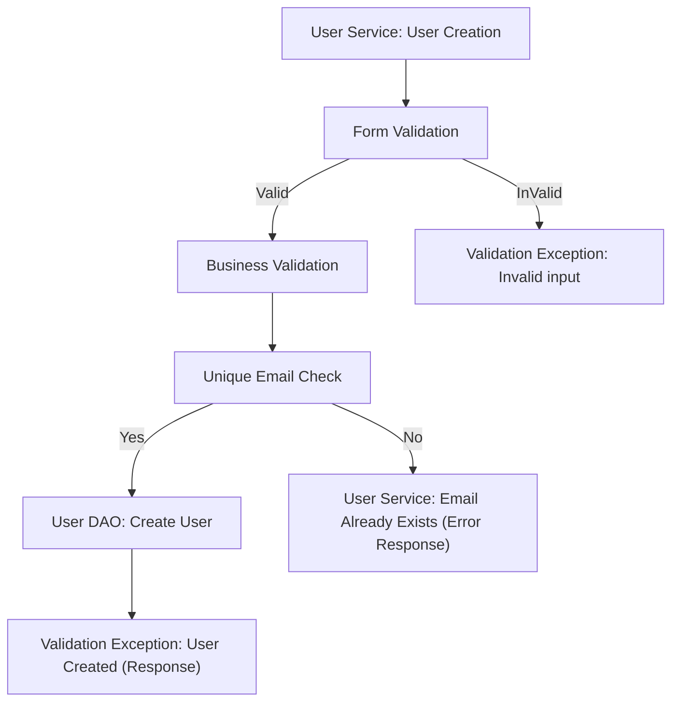
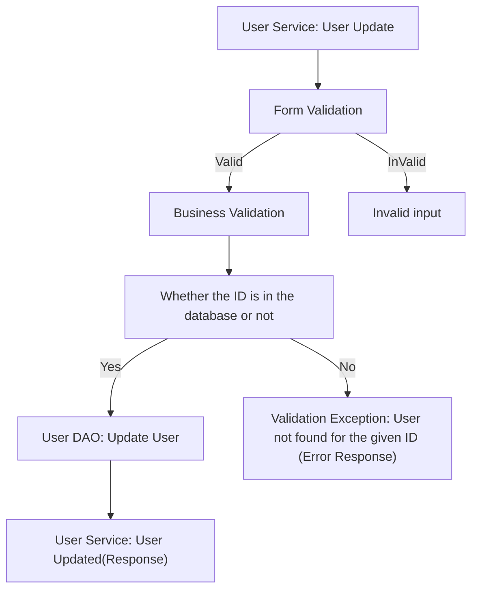
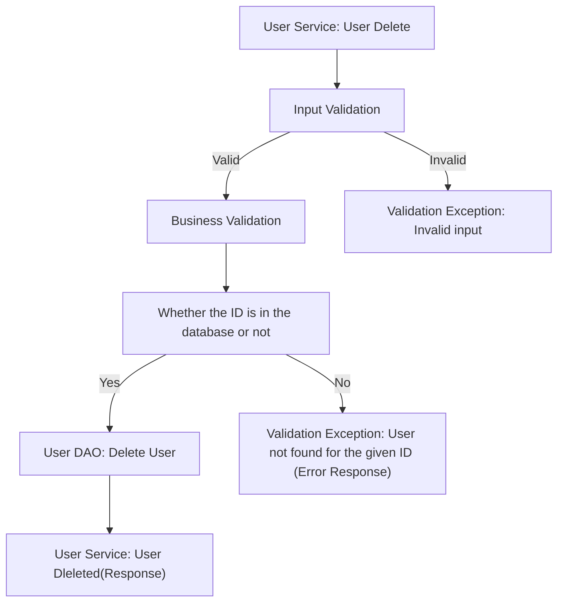
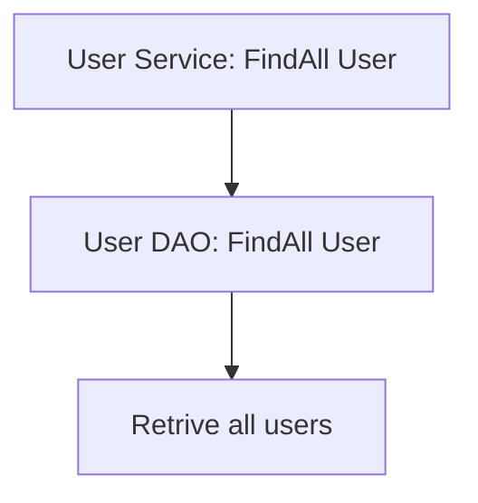
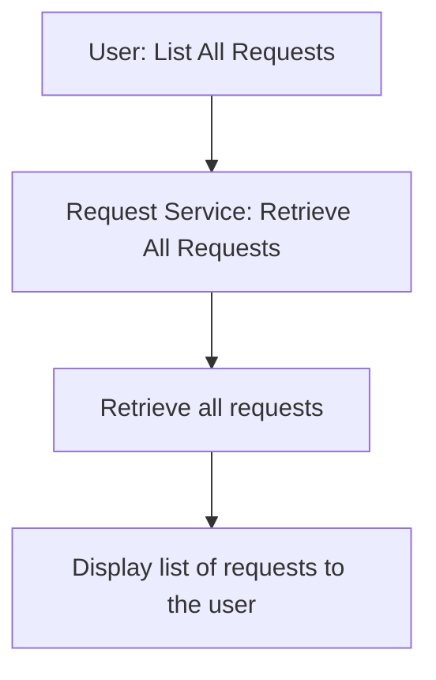
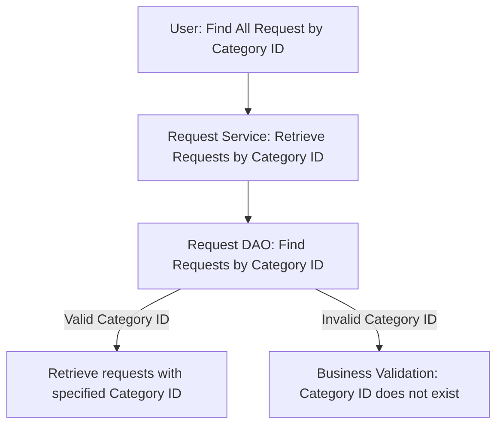
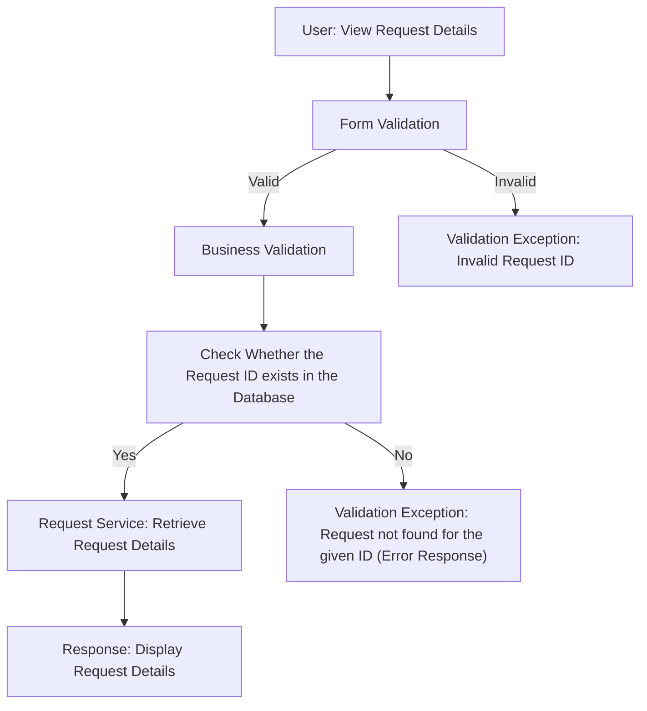
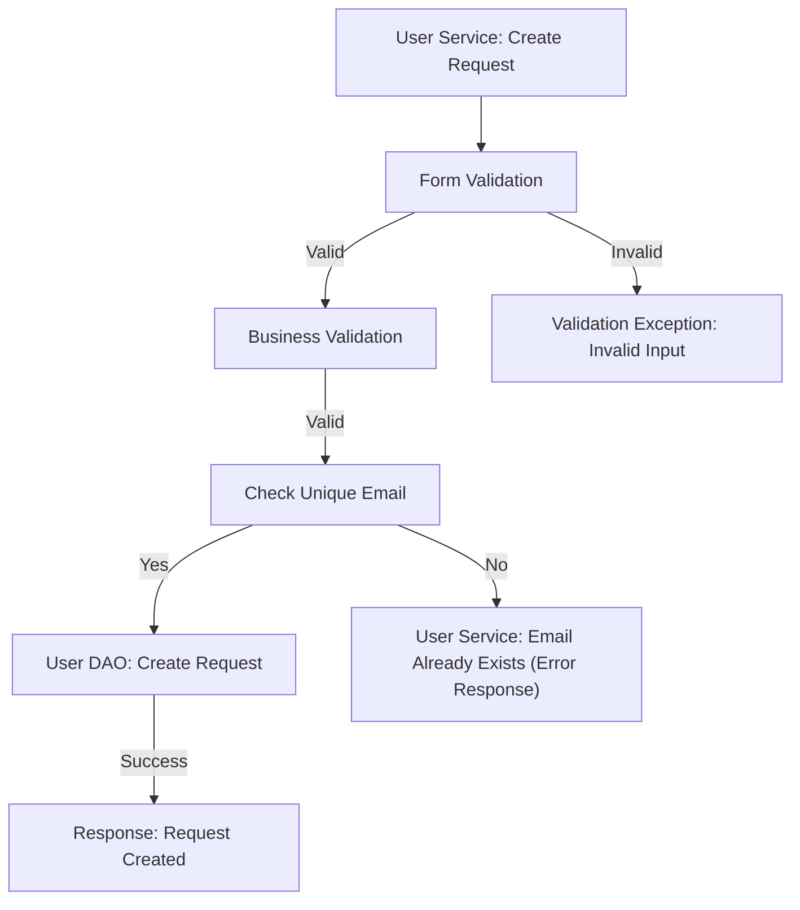
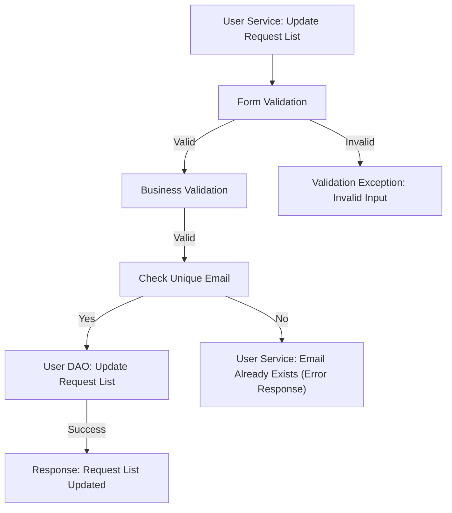
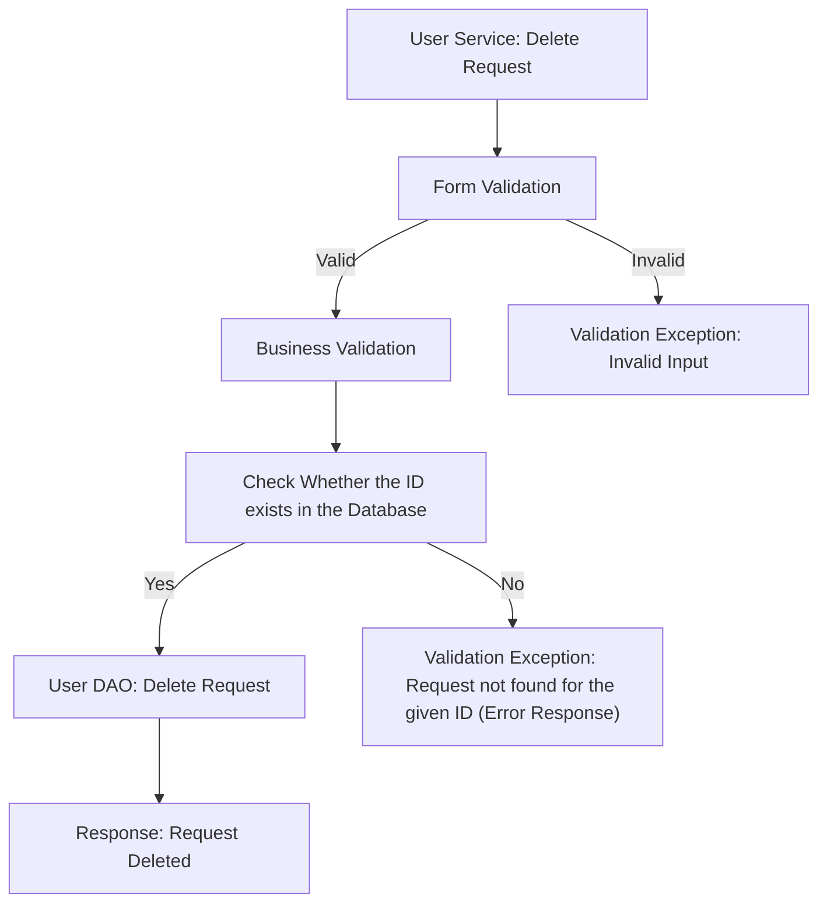

# demoapp-corejava-template

# KN funding 

## Database Design

- [ ] Create an ER diagram of the database
- [ ] Write Create table scripts

## Project Setup

- [ ] Create a new Java project
- [ ] Set up a MySQL database
- [ ] Add necessary libraries
	- [ ] JDBC, 
	- [ ] MySQL Connector, 
	- [ ] JUnit, 
	- [ ] Dotenv

## Module 1: User
#### Pre-requisites:
- [ ] Create User table
-  Attributes
		- int id
		- String name
		- String email
		- long phone_number
		- String password
		- boolean status
- [ ] User DAO
- [ ] User Service

		
### Feature 1: Create User
#### User story
User can create their profile.
#### Pre-requisites:
- Implements User Service(create)
- Implement User DAO(create)
- User table

#### Validation
- [ ] Form validation
		- user null
		- name (null or empty string)
		- email (null or empty string)
		- password (null or empty string)
		- email pattern validation
		- password pattern validation
		- phone_number ( >= 600000001 && <= 9999999999 )
- [ ] Business validation
		- email already Exists 		
		
#### Messages
- [ ] User cannot be null
- [ ] Invalid Email Id
- [ ] Password doesn't match the required format
- [ ] name cannot be null or empty
- [ ] email cannot be null or empty
- [ ] password cannot be null or empty
- [ ] phone_number doesn't match the required format
- [ ] User already exists(Business validation)

#### Flow: 

### Feature 2: Update User
#### User story
User can update their profile.
#### Pre-requisites:
- Implements User Service(update(int id, User user))
- Implement User DAO(update(int id, User user))
- User table

#### Validation
- [ ] Form validation
		- id <=0
		- user null check
		- name (null or empty string)
		- email (null or empty string)
		- password (null or empty string)
		- phone_number ( length, >= 600000001 && <= 9999999999 )
- [ ] Business validation
		- Check whether id is in the table or not 

#### Messages
- [ ] User cannot be null
- [ ] name cannot be null or empty
- [ ] email cannot be null or empty
- [ ] password cannot be null or empty
- [ ] Invalid Email Id
- [ ] Password doesn't match the required format
- [ ] phone_number doesn't match the required format
- [ ] User Id not found(Business validation)		
		
#### Flow: 

### Feature 3: Delete User
#### User story
User can delete their profile.
#### Pre-requisites:
- Implements User Service(delete(int id))
- Implement User DAO(delete(int id))
- User table

#### Validation
- [ ] Form validation
		- id <=0
- [ ] Business validation
		- Check whether id is in the table or not

#### Messages
- [ ] Invalid Id
- [ ] User Id not found(Business validation)		

#### Flow: 

### Feature 4: FindAll
#### User story
User can see all User details.
#### Pre-requisites:
- Implements User Service(getAll( ))
- Implement User DAO(findAll( ))
- User table

#### Flow: 

## Module 2: Donation Request
#### Pre-requisites
- [ ] Create Request table
-  Attributes
		- int id
		- String Name
		- String Description
		- int category_id
		- int amount
- [ ] Request DAO (create)
- [ ] Request Service (create)

### Feature 1: List All Requests

#### User story
Users can list all donation requests.

#### Pre-requisites
- [ ] Requests Table
- [ ] Implement Request DAO(findAll Request)
- [ ] Implement Request Service(findAll Request)

#### Validation
- None required for this feature.

#### Flow

### Feature 2: List All Requests By category_Id

#### User story
Users can list all donation requests based on a specific category ID.

#### Pre-requisites
- [ ] Category Table
- [ ] Category DAO
- [ ] Category Service 
- [ ] Requests Table
- [ ] Implement Request DAO (findAll Requests By category_Id)
- [ ] Implement Request Service (findAll Requests By category_Id)

#### Validation
- [ ] Form validation
 - Category ID: Required, must be a positive integer.
 - [ ] Business validation
  - Category ID: categoryId exists or not

#### Flow

### Feature 3: Request Details

#### User story
Users can view details of a specific donation request.

#### Pre-requisites
- [ ] Requests Table
- [ ] Implement Request DAO (findAll Request Details)
- [ ] Implement Request Service (findAll Request Details)

#### Validation
- [ ] Form validation
 - Request ID must be a positive integer.
- [ ] Business validation
 - Check whether the Request ID exists in the database.

#### Messages
- [ ] Invalid Request ID: Request ID must be a positive integer.

#### Flow

### Feature 4: Create new Request

#### User story
User can create Request

#### Pre-requisites:
- Implements Request DAO(create)
- Implement Request Service(create)
- Request table

### Validation
- [ ] Form validation
-  Name: Required, cannot be empty.
- Description: Required,more than 100 letters, cannot be empty.
- Category ID: Required, must be a positive integer.
- Amount: Required, must be a positive integer.

- [ ] Business validation
		- Id already Exists 
		- Email already Exists
		- Phone number already Exists		

#### Messages

- Name cannot be empty.
- Description cannot be empty.
- Description must be more than 100 letters, cannot be empty.
- Category ID must be a positive integer.
- Amount must be a positive integer.

#### Flow: 

### Feature 5: Update Request details
#### User story
User can update their Request detail.
#### Pre-requisites:
- Requests Table
-  [ ] Request DAO (Update)
- [ ] Request Service (Update)
#### Validation
- [ ] Form Validation

- Name: Required, cannot be empty.
- Description: Required,more than 100 letters, cannot be empty.
- Category ID: Required, must be a positive integer.
- Amount: Required, must be a positive integer.

- [ ] Business validation 
- Check whether id is in the Request table or not
- Check whether Category id is true or not
-  Check whether User id matches the Request Id or not 

#### Messages

- Name cannot be empty.
- Description cannot be empty.
- Description must be more than 100 characters.
- Category ID must be a positive integer.
- Amount must be a positive integer.

		
#### Flow: 

### Feature 6: Delete Request
#### User story
User can Delete their Request.
#### Pre-requisites:
- Requests Table
- [ ] Request DAO (Delete)
- [ ] Request Service (Delete)

#### Validation
- [ ] Form validation
    - ID must be a positive integer.

- [ ] Business validation
    - Check whether the ID exists in the table.

#### Messages
- [ ] Invalid ID: ID must be a positive integer.
- [ ] Request ID not found: Request not found for the given ID (Business validation).

#### Flow:

